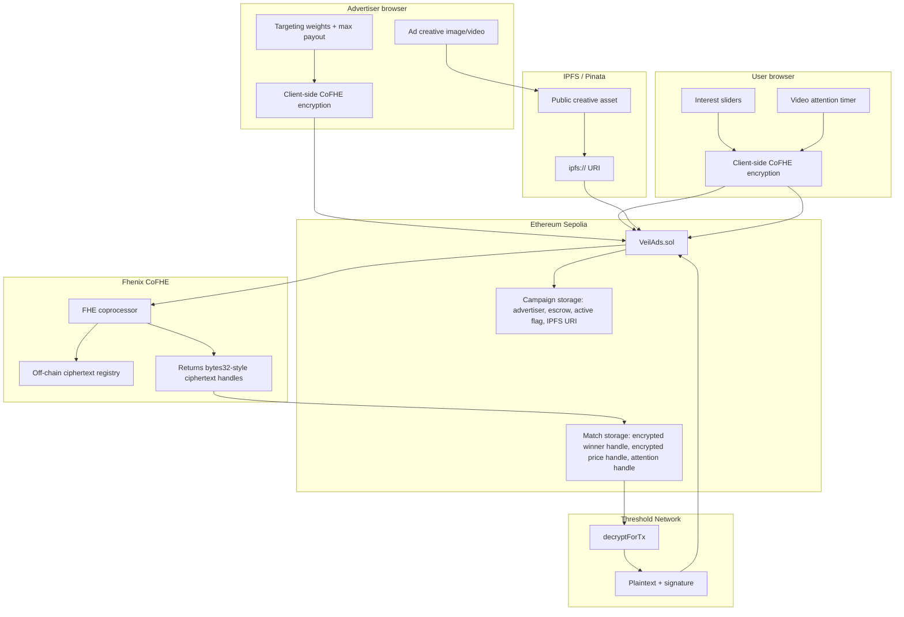
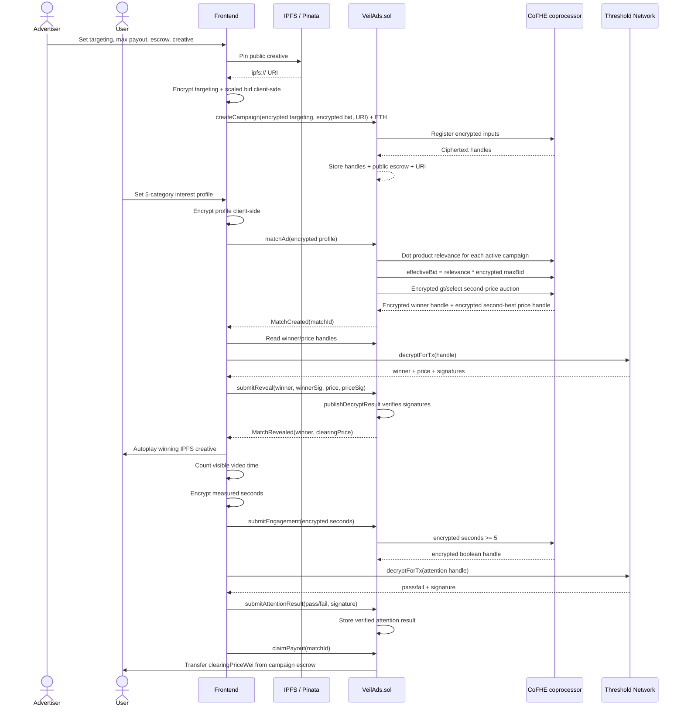
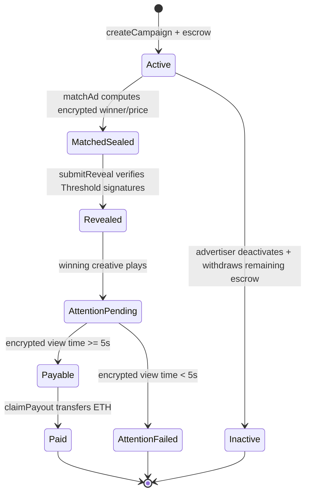

# VeilAds

**A confidential attention marketplace on Fhenix. You get paid for your attention instead of having it harvested for free.**

[](https://sepolia.etherscan.io/address/0x730A629BC7a80f622ceD3261bed443dE0419a1AC)
[](https://cofhe-docs.fhenix.zone)
[](contracts/VeilAds.sol)

---

Every time you browse, something profiles you: searches, scroll time, clicks, the shape of your attention. That shadow version of you gets sold to advertisers. You never agreed to it, you never see a cent from it, and the ads you get are often still irrelevant. The platform benefits. The ad broker benefits. The advertiser benefits.

You don't.

VeilAds turns that flow around. User interest profiles and advertiser targeting/bids are encrypted client-side before they ever touch the contract. Advertisers bid blind against ciphertext. The contract runs a relevance-weighted second-price auction through Fhenix CoFHE without decrypting either side. Only the winning campaign, the clearing price, and an attention pass/fail result ever become public. The user is paid directly from the winning campaign's native ETH escrow.

This isn't a "trust us not to look" policy. The raw values are never available to the app, the advertiser, or the contract in plaintext — not because anyone promised not to look, but because there's nothing to look at.

### At a glance

- **1 contract** — no cross-contract permission surface to manage
- **2 values decrypted per match** — winner ID and clearing price; everything else stays sealed
- **Native ETH escrow** — no custom token
- **44 passing tests** — Hardhat + CoFHE mocks, see [What Is Real vs Mocked](#what-is-real-vs-mocked)
- **Live on Ethereum Sepolia** — [`0x730A6...9a1AC`](https://sepolia.etherscan.io/address/0x730A629BC7a80f622ceD3261bed443dE0419a1AC)

### Contents

- [Architecture](#architecture)
- [Match Flow](#match-flow)
- [Contract Internals](#contract-internals)
- [What Is Real vs Mocked](#what-is-real-vs-mocked)
- [Tech Stack](#tech-stack)
- [Deployed Contract](#deployed-contract)
- [Campaign Lifecycle](#campaign-lifecycle)
- [Minimal Runbook](#minimal-runbook)

---

## Architecture

There are two separate data paths through this system, and they don't cross. The encrypted auction data goes through CoFHE and is represented on-chain as fixed-size handles. The ad creative is public media, pinned to IPFS, with only its URI stored by the contract.



The distinction that matters is storage. `VeilAds.sol` stores encrypted values as CoFHE handles (`euint8`, `euint32`, `euint128`, `ebool`) — never raw ciphertext blobs. Ciphertext and proof payloads arrive as calldata inside `InEuint*` structs, get registered with CoFHE through `FHE.asEuint*`, and the contract keeps only the resulting handle.

## Match Flow

One complete cycle, end to end — campaign creation through payout.



## Contract Internals

### Why one contract

`contracts/VeilAds.sol` is intentionally a single contract. CoFHE permissions are tied to contract addresses — splitting campaign storage, auction logic, reveal, and payout into separate contracts would mean granting `FHE.allow` across contract boundaries for every handle that crosses one. That's permission surface with no upside for this flow. Instead, the contract is organized internally into five sections: campaign management, auction, reveal, attention, and payout.

### Why gas stays bounded

The contract never stores ciphertext payloads. Advertiser targeting and user profile values arrive as calldata, get passed through `FHE.asEuint8` / `FHE.asEuint64` / `FHE.asEuint32`, and only the resulting handle is stored. Public fields stay public by design: advertiser address, escrow amount, active status, `adURI`. Bid, targeting weights, user profile, relevance scores, and every losing effective bid stay off view functions entirely.

### The auction math

```text
relevance = sum(userProfile[i] * campaign.targeting[i])
max relevance = 5 * 100 * 100 = 50,000
effective bid = relevance * encrypted maxBid
```

The shipped contract accepts the encrypted bid as `InEuint64`, widens it to `euint128`, and stores `Campaign.maxBid` and the effective bid as `euint128`. That headroom matters: a realistic ETH-denominated bid multiplied by a 50,000 relevance ceiling can overflow a narrower encrypted integer. The test suite includes a case where `0.01 ETH` with all-max sliders produces `2.5e20` wei as the clearing price — not safe under an `euint64` ceiling, which is why the wider type is load-bearing here, not incidental.

### Two decrypt paths, one used for state changes

Local view decrypts are useful for display, but the contract can't trust a browser's claimed plaintext when real ETH is on the line. Winner ID, clearing price, and the attention boolean are all revealed through `decryptForTx`: the frontend submits plaintext plus a Threshold Network signature, and `FHE.publishDecryptResult` verifies it before `VeilAds.sol` stores the result.

### Payout ordering

`claimPayout` follows standard checks-effects-interactions: it requires the match to be revealed, attention to have passed, the caller to be the matched user, and escrow to cover the clearing price — then sets `paidOut = true` and deducts escrow *before* sending ETH. The same frozen-state check blocks a later `submitEngagement` or `submitAttentionResult(false)` call from flipping a settled match back into an unpaid or failed state.

## What Is Real vs Mocked

| Area | Current implementation |
|---|---|
| Campaign creation | Real contract call on Ethereum Sepolia. Targeting and bid are encrypted client-side with `@cofhe/sdk`; native ETH escrow is held by `VeilAds.sol`. |
| Auction | Real sealed second-price auction in Solidity using CoFHE operations over encrypted handles. Requires at least two active campaigns. Strict ties keep the earlier campaign id, since the contract uses `FHE.gt`, not `gte`, for replacement. |
| Reveal | Real publish-decrypt flow: `decryptForTx` returns plaintext plus a signature; the contract accepts it through `FHE.publishDecryptResult`. |
| Attention gate | FHE mode is enabled (`ATTENTION_MODE_FHE = true`). The frontend measures video time in-browser and encrypts the measured seconds; the contract reveals only pass/fail against a public 5-second threshold. |
| Payout | Real native ETH transfer from the winning campaign's escrow to the matched user. No ERC20 token. |
| Ad creative | Public by design. The frontend uploads media through Pinata/IPFS and stores the resulting URI on-chain in plaintext. |
| Interest source | Demo UI sliders. No browser-history scraping, behavioral tracker, or local model. |
| Tests | Hardhat tests use CoFHE mocks — real handle-based API, plaintext assertions internally, not live Threshold Network tests. `npx hardhat test` currently reports 44 passing across the starter counter and VeilAds suites. |

## Tech Stack

| Layer | Stack |
|---|---|
| Contract | Solidity `^0.8.25`, compiled with Hardhat Solidity `0.8.28`, `viaIR`, Cancun EVM |
| FHE | `@fhenixprotocol/cofhe-contracts`, `@cofhe/sdk`, `@cofhe/hardhat-plugin` |
| Network | Ethereum Sepolia via CoFHE's `eth-sepolia` Hardhat network config |
| Frontend | Next.js 15, React 19, TypeScript |
| Wallet / chain client | wagmi, viem, injected MetaMask connector |
| Creative storage | Pinata API route + IPFS URI |

## Deployed Contract

| Field | Value |
|---|---|
| Network | Ethereum Sepolia |
| Hardhat network name | `eth-sepolia` |
| Contract | `VeilAds` |
| Address | `0x730A629BC7a80f622ceD3261bed443dE0419a1AC` |
| Etherscan | [0x730A629BC7a80f622ceD3261bed443dE0419a1AC](https://sepolia.etherscan.io/address/0x730A629BC7a80f622ceD3261bed443dE0419a1AC) |
| Deployment file | `deployments/eth-sepolia.json` |

## Campaign Lifecycle



## Minimal Runbook

Install and test contracts:

```bash
npm install
npx hardhat compile
npx hardhat test
```

Deploy to Ethereum Sepolia:

```bash
# root .env
PRIVATE_KEY=0x...
SEPOLIA_RPC_URL=https://...
ETHERSCAN_API_KEY=...

npx hardhat deploy-veilads --network eth-sepolia --verify
```

Run the frontend:

```bash
cd frontend
npm install

# frontend/.env.local
NEXT_PUBLIC_VEILADS_ADDRESS=0x730A629BC7a80f622ceD3261bed443dE0419a1AC
NEXT_PUBLIC_VEILADS_DEPLOY_BLOCK=11200352
NEXT_PUBLIC_SEPOLIA_RPC_URL=https://...
NEXT_PUBLIC_PINATA_GATEWAY=https://gateway.pinata.cloud/ipfs/
PINATA_JWT=...

npm run dev
```

For Vercel: set the project root to `frontend`, and put only the frontend variables above in Vercel's project settings. The root Hardhat `PRIVATE_KEY` never belongs there.
