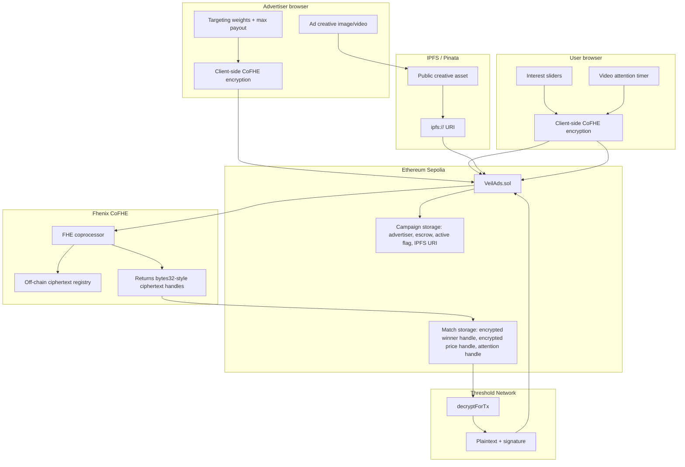
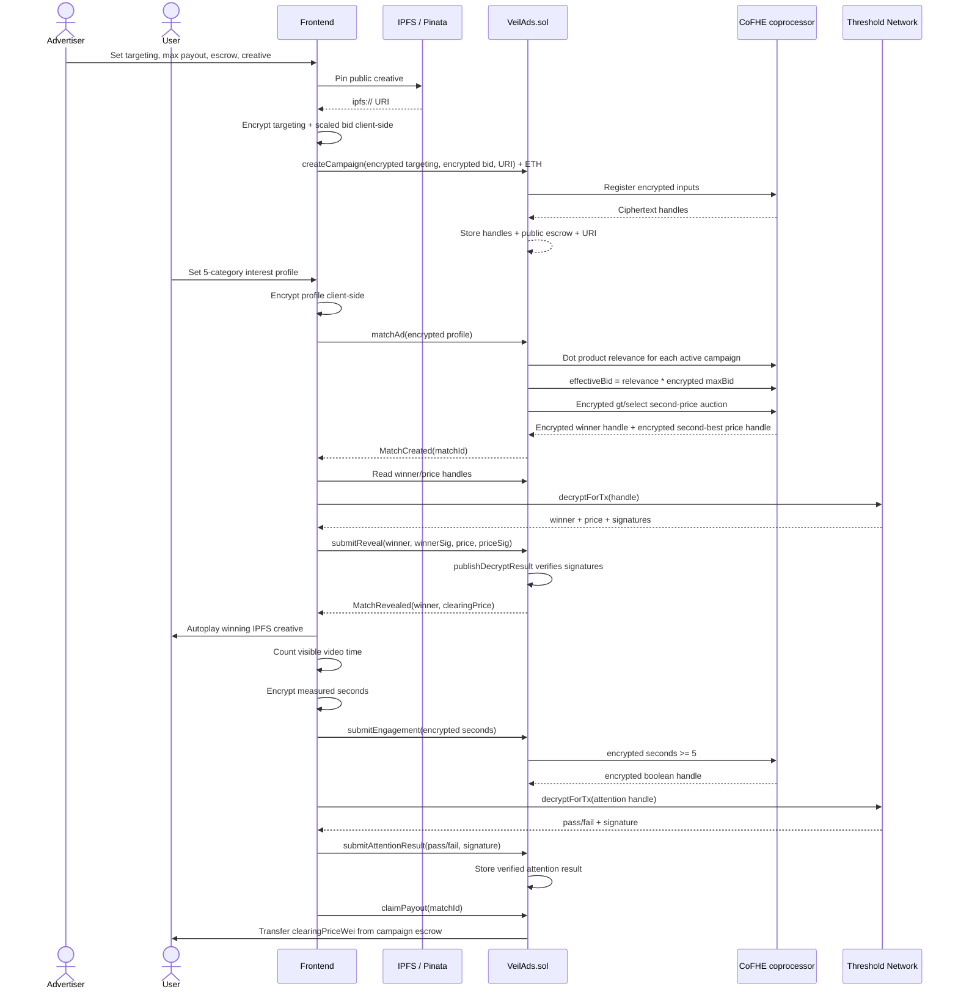
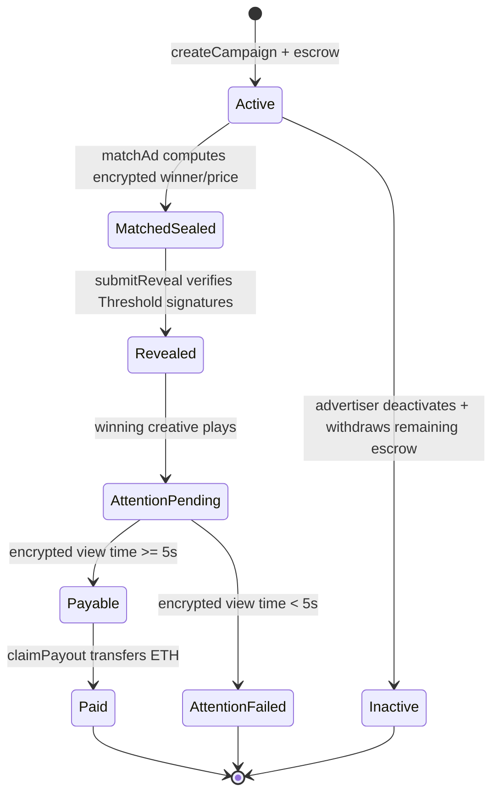

# VeilAds

Every time you browse, something profiles you: searches, scroll time, clicks, the shape of your attention. That shadow version of you gets sold to advertisers. You never agreed to it, you never see a cent from it, and the ads you get are often still irrelevant. The platform benefits, the ad broker benefits, the advertiser benefits. You do not.

VeilAds turns that flow into a confidential attention marketplace. User interest profiles and advertiser targeting/bids are encrypted client-side before they touch the contract. Advertisers bid blind against ciphertext. The contract runs a relevance-weighted second-price auction through Fhenix CoFHE without decrypting either side. Only the winning campaign, clearing price, and attention pass/fail result become public facts, and the user is paid from the winning campaign's native ETH escrow. This is not a "trust us not to look" policy; the raw values are never available to the app, advertiser, or contract in plaintext.

## Architecture

There are two separate data paths. The encrypted auction data goes through CoFHE and is represented on-chain as fixed-size handles. The ad creative is public media, pinned to IPFS, and only its URI is stored by the contract.



The important distinction is storage. `VeilAds.sol` stores encrypted values as CoFHE handles (`euint8`, `euint32`, `euint128`, `ebool`), not raw ciphertext blobs. The ciphertext and proof payloads arrive as calldata in `InEuint*` structs, are registered with CoFHE through `FHE.asEuint*`, and the contract keeps only the resulting handle.

## Match Flow



## Contract Internals

`contracts/VeilAds.sol` is intentionally one contract. CoFHE permissions are tied to contract addresses; splitting campaign storage, auction logic, reveal, and payout into separate contracts would require extra cross-contract `FHE.allow` grants for every handle that crosses a boundary. For this project, that would add permission surface without improving the user flow. The single contract is divided into campaign management, auction, reveal, attention, and payout sections instead.

Gas stays bounded because the contract does not store ciphertext payloads. Advertiser targeting and user profile values enter as calldata, the contract calls `FHE.asEuint8` / `FHE.asEuint64` / `FHE.asEuint32`, and only the handle is stored. Public fields are deliberately public: advertiser address, escrow amount, active status, and `adURI`. The bid, targeting weights, user profile, relevance scores, and losing effective bids are not exposed by view functions.

The auction computes relevance as a five-term encrypted dot product:

```text
relevance = sum(userProfile[i] * campaign.targeting[i])
max relevance = 5 * 100 * 100 = 50,000
effective bid = relevance * encrypted maxBid
```

The shipped contract accepts the encrypted bid as `InEuint64`, widens it to `euint128`, and stores `Campaign.maxBid` as `euint128`. The effective bid is also `euint128`. This matters: realistic ETH-denominated bids multiplied by a 50,000 relevance ceiling can overflow smaller encrypted integer widths. The tests include a demo-click case where `0.01 ETH` with all-max sliders produces `2.5e20` wei as the clearing price, which would not be safe under an `euint64` effective-bid ceiling.

There are two decrypt paths conceptually, and VeilAds uses the publish path for anything that changes contract state. Browser-only view decrypts are useful for display, but the contract cannot trust a browser's claimed plaintext when real ETH is involved. Winner ID, clearing price, and the attention boolean are all revealed through `decryptForTx`; the frontend submits plaintext plus the Threshold Network signature, and `FHE.publishDecryptResult` verifies it before `VeilAds.sol` stores the result.

Payout uses a standard checks-effects-interactions order. `claimPayout` requires the match to be revealed, attention to have passed, caller to be the match user, and escrow to cover the clearing price. It sets `paidOut = true` and subtracts escrow before sending ETH. The same frozen-state rule also blocks later `submitEngagement` or `submitAttentionResult(false)` calls from flipping a settled match back into an unpaid or failed-attention state.

## What Is Real vs Mocked

| Area | Current implementation |
|---|---|
| Campaign creation | Real contract call on Ethereum Sepolia. Targeting and bid are encrypted client-side with `@cofhe/sdk`; native ETH escrow is held by `VeilAds.sol`. |
| Auction | Real sealed second-price auction in Solidity using CoFHE operations over encrypted handles. Requires at least two active campaigns. Strict ties keep the earlier campaign id because the contract uses `FHE.gt`, not `gte`, for replacement. |
| Reveal | Real publish-decrypt flow: `decryptForTx` returns plaintext plus signature; contract accepts the value through `FHE.publishDecryptResult`. |
| Attention gate | FHE mode is enabled in the deployed contract with `ATTENTION_MODE_FHE = true`. The frontend currently measures video time from the browser and encrypts the measured seconds; the contract reveals only pass/fail against the public 5 second threshold. |
| Payout | Real native ETH transfer from winning campaign escrow to the matched user. No ERC20 token. |
| Ad creative | Public by design. The frontend uploads media through Pinata/IPFS and stores the resulting URI on-chain in plaintext. |
| Interest source | Demo UI sliders. There is no browser-history scraping, behavioral tracker, or local model. |
| Tests | Hardhat tests use CoFHE mocks. They preserve the handle-based API and verify plaintext internally for assertions, but they are not live Threshold Network tests. `npx hardhat test` currently reports 44 passing tests across the starter counter and VeilAds suites. |

## Tech Stack

| Layer | Stack |
|---|---|
| Contract | Solidity `^0.8.25`, compiled with Hardhat Solidity `0.8.28`, `viaIR`, Cancun EVM |
| FHE | `@fhenixprotocol/cofhe-contracts`, `@cofhe/sdk`, `@cofhe/hardhat-plugin` |
| Network | Ethereum Sepolia via the CoFHE Hardhat network config `eth-sepolia` |
| Frontend | Next.js 15, React 19, TypeScript |
| Wallet / chain client | wagmi, viem, injected MetaMask connector |
| Creative storage | Pinata API route + IPFS URI |

## Deployed Contract

| Field | Value |
|---|---|
| Network | Ethereum Sepolia |
| Hardhat network name | `eth-sepolia` |
| Contract | `VeilAds` |
| Address | `0x730A629BC7a80f622ceD3261bed443dE0419a1AC` |
| Etherscan | [0x730A629BC7a80f622ceD3261bed443dE0419a1AC](https://sepolia.etherscan.io/address/0x730A629BC7a80f622ceD3261bed443dE0419a1AC) |
| Deployment file | `deployments/eth-sepolia.json` |

## Campaign Lifecycle



## Minimal Runbook

Install and test contracts:

```bash
npm install
npx hardhat compile
npx hardhat test
```

Deploy to Ethereum Sepolia:

```bash
# root .env
PRIVATE_KEY=0x...
SEPOLIA_RPC_URL=https://...
ETHERSCAN_API_KEY=...

npx hardhat deploy-veilads --network eth-sepolia --verify
```

Run the frontend:

```bash
cd frontend
npm install

# frontend/.env.local
NEXT_PUBLIC_VEILADS_ADDRESS=0x730A629BC7a80f622ceD3261bed443dE0419a1AC
NEXT_PUBLIC_VEILADS_DEPLOY_BLOCK=11200352
NEXT_PUBLIC_SEPOLIA_RPC_URL=https://...
NEXT_PUBLIC_PINATA_GATEWAY=https://gateway.pinata.cloud/ipfs/
PINATA_JWT=...

npm run dev
```

For Vercel, set the project root to `frontend`. Put only the frontend variables in Vercel project settings. Do not put the root Hardhat `PRIVATE_KEY` in Vercel.
